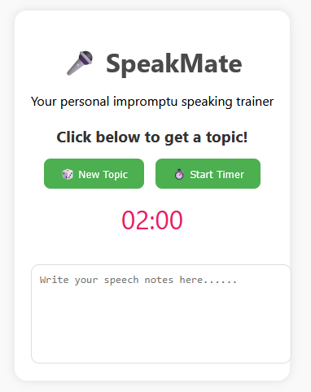

# 🎤 SpeakMate – Public Speaking Practice Web App

SpeakMate is a lightweight, responsive web app built to help students, public speakers, and Gaveliers enhance their **impromptu speaking skills**. Users can generate random speaking topics and use a countdown timer to simulate real-time practice sessions.

## 🌟 Features

- 🎲 Random impromptu speaking topics
- ⏱️ 2-minute countdown timer
- 📝 Text area for note-taking
- 💻 Responsive design for desktop & mobile
- 📦 Static frontend – no backend or login required

## 🚀 Live Demo

👉 [Click here to use SpeakMate](https://Sandadinu.github.io/speakmate)

## 📂 Tech Stack

- HTML5
- CSS3 (Responsive styling)
- JavaScript (DOM manipulation, timer logic)

## 📸 Preview

  
*(You can take a screenshot of your app and name it `preview.png` in your repo)*

## 🎯 Use Case

Designed for:
- Gavel Club members
- Students preparing for interviews, debates, or announcements
- Anyone practicing spontaneous public speaking

